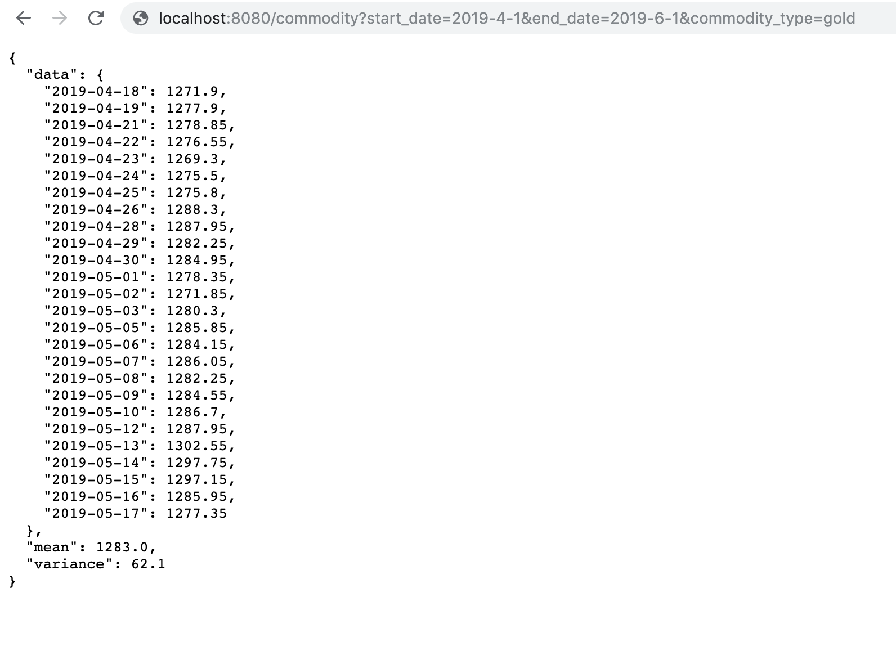
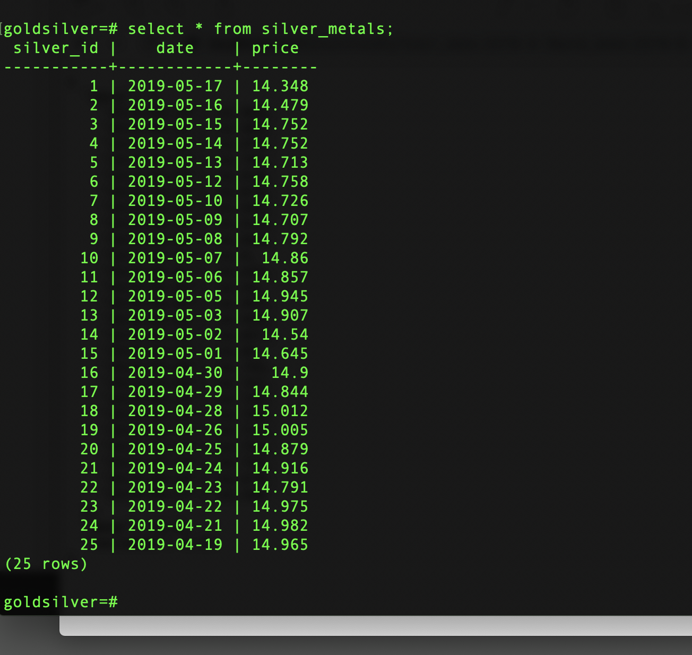
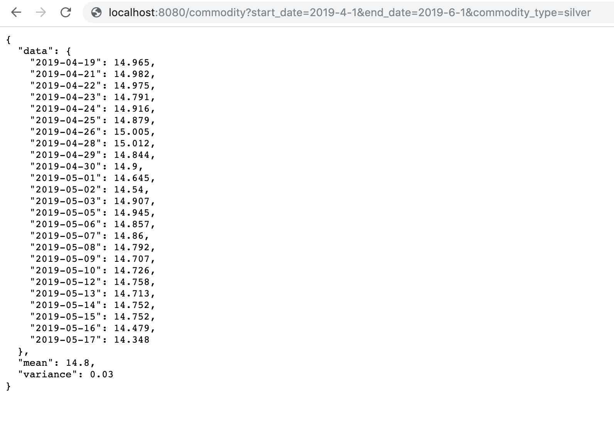

# RestFul API 
In this project I got gold and silver prices and dates from 2 URLs and stored them in a PostgreSql database. I built a program that will start an API web-service on port 8080 (using flask) that will return the stored data.
I Created an endpoint that will accept HTTP GET with arguments, and returning a json time series, mean and variance computed over the specified period

## Table of Contents
* [Fetch the historical prices and dates](#Fetch-the-historical-prices-and-dates)
* [Database](#Database)
* [Commodity endpoint](#Commodity-endpoint)
* [unittest](#unittest)
* [Tech Stack](#Tech-Stack)
* [Detailed question](#Detailed-questions)
* [Setup and installation](#Setup-and-installation)

### Fetch the historical prices and dates
I used the python requests module to get html from the urls, and beautiful soup to extract the required data. the code can be found in the <a href="https://github.com/Claire56/Takehome_assignmet/blob/master/seed.py"> seed.py file </a>

### Database
I created a database with two tables gold_metals and silver_metals using PostgreSql  database, details about the data model can be accessed <a href="https://github.com/Claire56/Takehome_assignmet/blob/master/data_model.py"> data_model.py </a> 
#### Seeding the database
I seeded the database by getting data from the url , details of the seeding can be found <a href="https://github.com/Claire56/Takehome_assignmet/blob/master/seed.py"> seed.py 

#### Database output screenshot

### Commodity endpoint
I used flask to create the endpont, details can be found in the <a href="https://github.com/Claire56/Takehome_assignmet/blob/master/server.py"> servery.py file </a> 
#### Silver output screenshot

### Unittest
I used Test case  to write the tests, details can be seen in
<a href="https://github.com/Claire56/Takehome_assignmet/blob/master/tests.py"> tests.py file </a> 

### Teck stack
Programming: Python 3  
Framework: Flask  
Database: PostgreSQL  
Libraries and Modules: Beautiful Soup , Unittest , requests,sqlAlchamey ,datetime, pandas, json, decimal

### Setup and installation
On local machine, go to desired directory. Clone  repository:

$ git clone https://github.com/Claire56/Takehome_assignmet  
Create a virtual environment in the directory:

$ virtualenv env 
Activate virtual environment: 

$ source env/bin/activate  
Install dependencies: 
$ pip install -r requirements.txt  
Create database:  

$ createdb goldsilver 
Build database: 

$ python3 -i data_model.py 
>>> db.create_all()  
Seed database:

$ python3 -i seed.py  
Run app:

$ python3 server.py  
Navigate to localhost:8080 in browser.

### Detailed Questions
1. Please write a program to fetch the historical prices and dates of gold and silver from these 2 URLs:
https://www.investing.com/commodities/gold-historical-data
https://www.investing.com/commodities/silver-historical-data
 
and store them locally (in a csv file, or other file or database, as you see fit). 
Please extract the Date and Price fields only from the current static page.

2. Please write a second program that will start an API web-service on port 8080 (use flask) that will return the stored data
Create an endpoint that will accept HTTP GET with following arguments, and returning a json time series, mean and variance computed over the specified period
  * start_date - required (iso format like 2017-05-10)
  * end_date - required (iso format like 2017-05-22)
  * commodity_type - required (gold, silver)
  
example of calling by using curl:
  curl 'http://127.0.0.1:8080/commodity?start_date=2017-05-10&end_date=2017-05-22&commodity_type=gold'

3. Bonuses
- Using docker/docker compose to wrap the application in containers is a plus.
- Using mysql database to store data is a plus (order of preference: mysql, postgres, sqlite, csv).
- Writing unit test cases is a plus.

example of output data:
  {
  "data": {
 "2017-05-10": 1253.06,
 "2017-05-11": 1280.46,
 "2017-05-12": 1278.21
  }
  "mean": 1270.57,
  "variance": 231.39
  }

